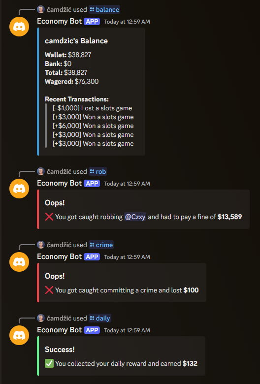
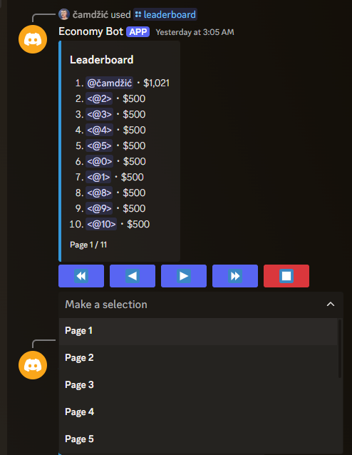
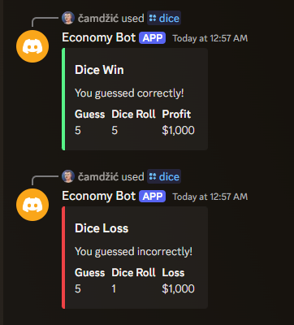
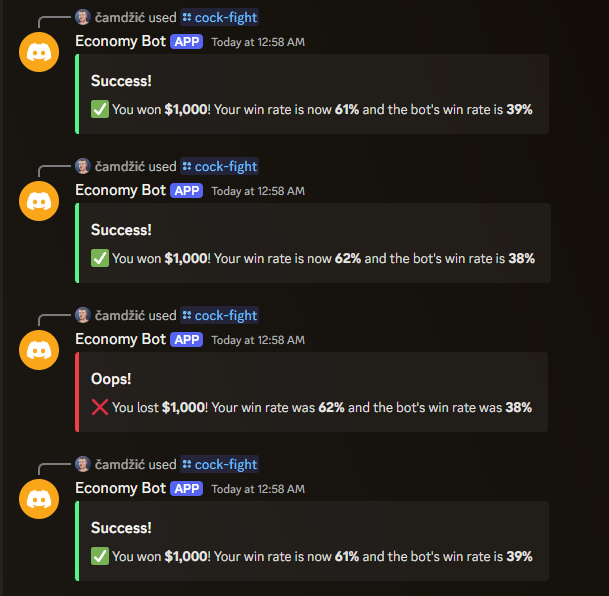

# economy-bot

This bot is bootstrapped from my [Sapphire Boilerplate](https://github.com/camdzic/sapphire-boilerplate). It's a simple economy bot that uses MongoDB as its database.

## Features

- [x] Economy
  - [x] Basic commands for managing user balances and transactions.
  - [x] Daily rewards to encourage user engagement.
- [x] Minigames
  - [x] Dice game where users can bet and try their luck.
  - [x] Slot machine for a chance to win big.
  - [x] Cockfighting, where users can pit their virtual roosters against each other.
- [x] Leaderboard
  - [x] Leaderboard service to rank users based on their in-game wealth.
  - [x] Caching system to optimize leaderboard performance.

## Images

  
  
  
  
  
  

## Attributions

Thank you to the following projects for making this possible:

- [Sapphire](https://sapphirejs.dev/)
- [discord.js](https://discord.js.org)
- [mongoose](https://mongoosejs.com/)
